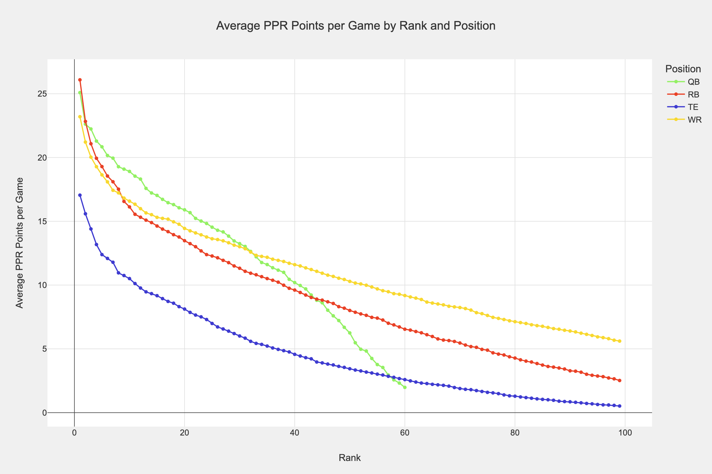
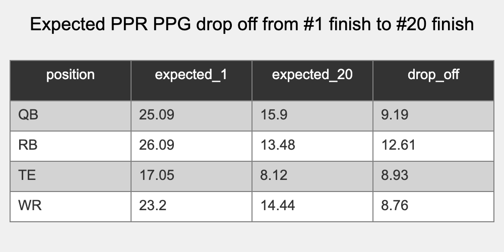
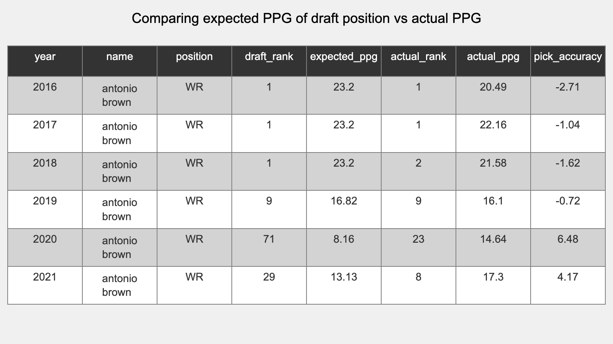

# Late round appendix

What's up ... ? It's JJ ... welp ... kinda.

JJ Zachariason is a fantstic fantasy football analyst - check him out at https://lateround.com/.

I've listened to fantasy analysis for years, and always thought that there could be more "objective" analysis.

JJ heard that call and answered it. He pioneered things like the running back "dead zone" and "late round quarterback".

His analysis is thorough, inspirational, and through provoking.

My goal in this guide is to explore those thoughts and add to his analysis. 

Have you ever heard things like:
* Rookie tight ends never work out
* Mobile quarterbacks don't dump off to the running back
* I'm buying a post-hype sleeper
* You should draft RBs early
* He's done it before
* Year 3 WR breakout incoming

We'll look at the data behind those claims and (hopefully) all be better informed for it.

## Expected fantasy points for a given draft pick
One of the things JJ is famous for is the chart below that shows how many points you expect to get when you draft a given player based on their draft position.

I love this chart, I think it's great. 
In fact, I think it's so great that we're going to start from this point too!  

However, we're going to make one change. Instead of looking at what you'd get if you drafted someone at that point, we're going to look at the actual finish of the player. 

In JJ's chart, it's the average of all the RBs that drafted at RB1, in this chart, it's the average of the RBs that finished at RB1. 

I think both ways are accurate, JJs shows what you can expect based on the market, and here we show what you'd get if the market was 100% accurate.

Wonderful, we have a place to start from!

**Some observations:**

1. QB
    1. Wow that line is steep - turns out it's hard to play QB in the NFL
    1. The bottom likely includes players that only came in for a few plays
    1. The 20th QB scores roughly 15 ppg (not bad!) ... but can we reliably draft them?
1. RB 
    1. This looks a lot like JJ's line
    1. It's gooood at the top - the RB1 usually outperforms all players
    1. The 40th RB scores ~10 ppr ppg, this is the bench guy you'll play in a pinch
1. WR
    1. WRs underperform RB at the top. RB1-9 score more than WR1-9, but WR is much deeper
    1. The 40th WR scores ~12 ppr ppg, a waiver guy that excites no one, but a better FLEX than the RB40
1. TE
    1. Kelce, always Kelce. I'm sure Kelce is skewing the data at the top end.
    1. The top TE usually

Here's a an overview of the drop off from 1 - 20 for the key positions

Wonderful, you can see that the drop off from QB is strong, but the drop off for RB is WAY stronger. I think we know this intuitively, a TOP RB is a massive advantage, and you aren't that excited to sub in an RB2 or RB3 if they go down. 

The question is, can we reliably draft those RBs?

This chart is where they finish, but can we know that order before the season ... read on. 

### Draft predictability
We have the expected points for a given finish, and we have the place that a player was drafted, so we can compare those two to see if the draft pick was correct or not.

Here's an example (all hypothetical):
* Antonio Brown is drafted as the WR8 in 2016
* The WR8 historically produces 17 ppr points per game
* Antonio Brown only produces 12 ppr points per game
* We as a community had an accuracy miss of -5 ppr points per game

Here's a real example

### Expected points - average is ... average ? 
Look at the expected points graph with one line for each year and a line for average.

## Draft strategy
### Health

### Simulations

<!--
Hype vs accuracy
Computing the best draft possible in historical years
WR vs RB and when to draft one vs the other (this and that vs that and this)

Vacated targets
Team totals
Supporting 2 wr or 2 rb or 1 wr and 1 rb

"They've done it before" 
-->