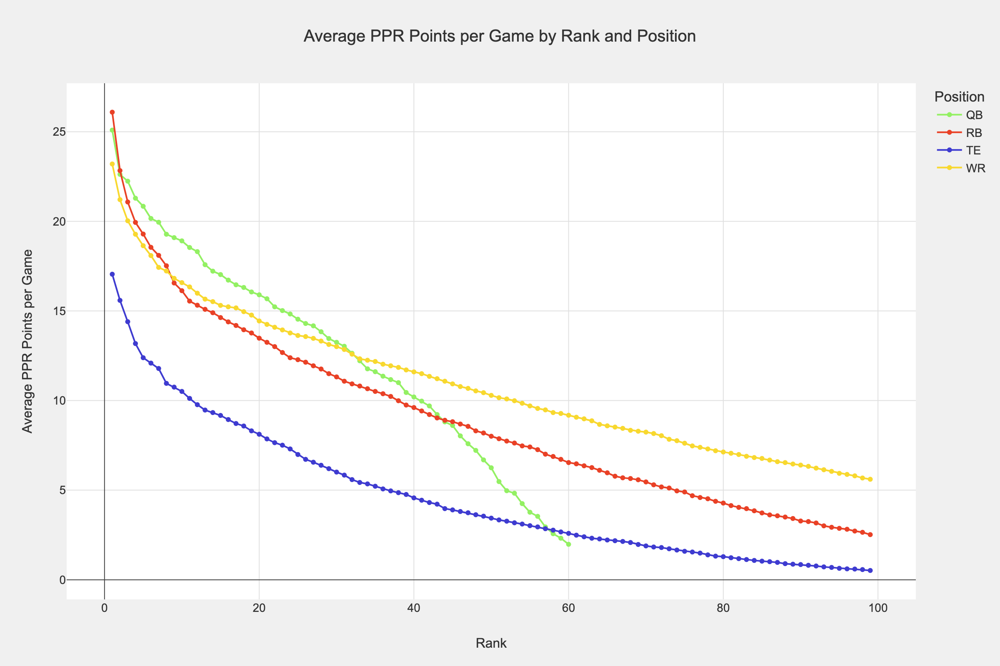
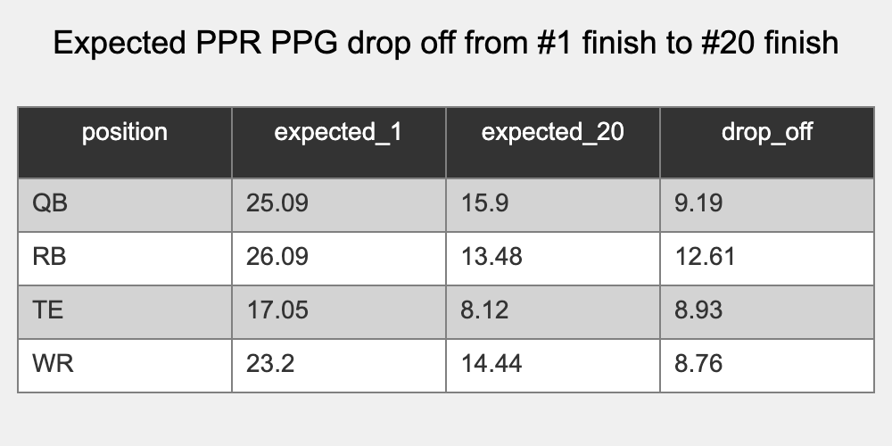
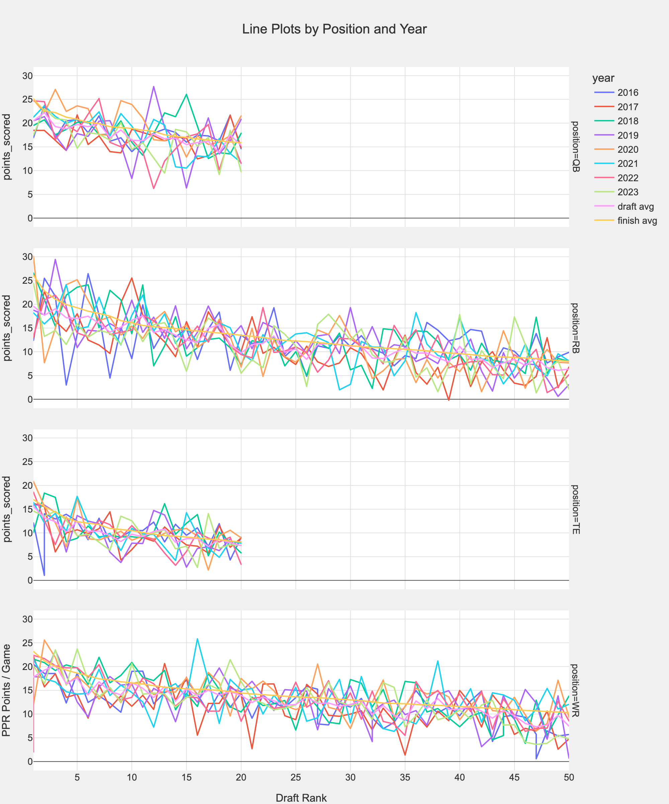
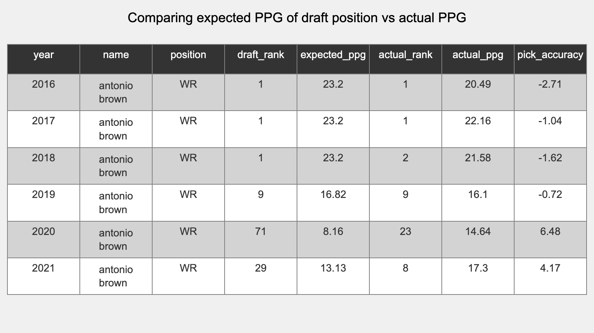
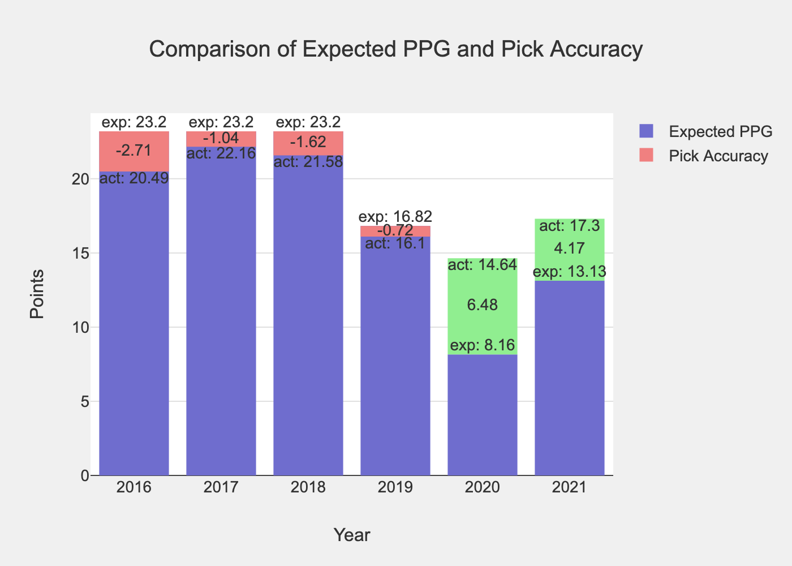
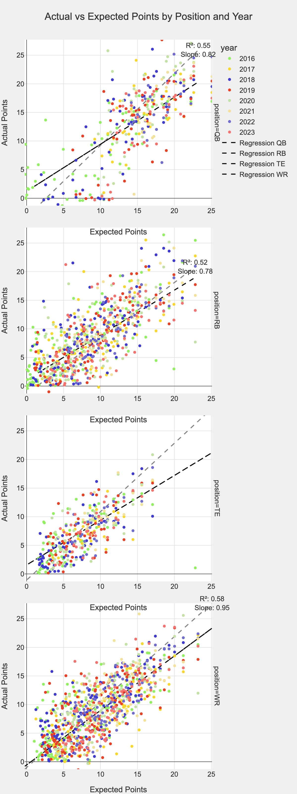
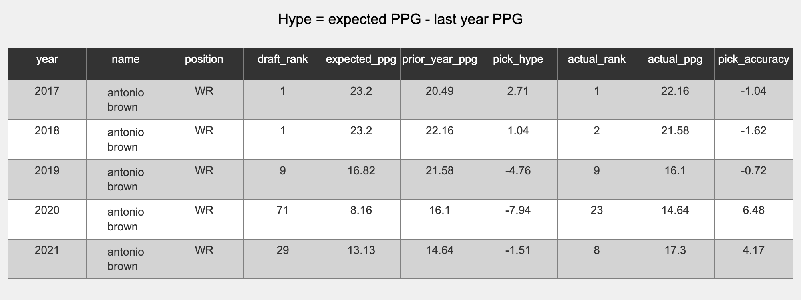
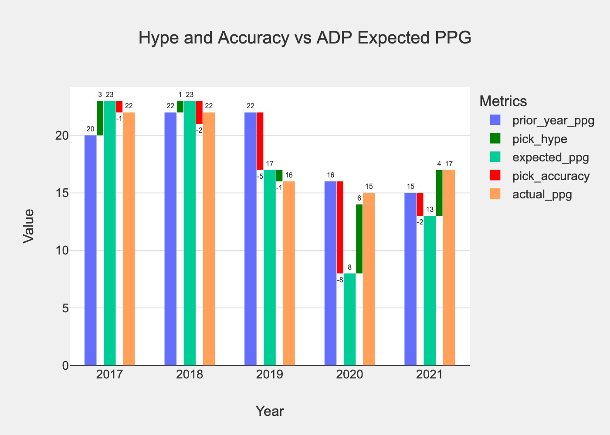

# Late round appendix

What's up ... ? It's JJ ... welp ... kinda.

JJ Zachariason is a fantstic fantasy football analyst - check him out at https://lateround.com/.

I've listened to fantasy analysis for years, and always thought that there could be more "objective" analysis.

JJ heard that call and answered it. He pioneered things like the running back "dead zone" and "late round quarterback".

His analysis is thorough, inspirational, and through provoking.

My goal in this guide is to explore those thoughts and add to his analysis. 

Have you ever heard things like:
* Rookie tight ends never work out
* Mobile quarterbacks don't dump off to the running back
* I'm buying a post-hype sleeper
* You should draft RBs early
* He's done it before
* Year 3 WR breakout incoming

We'll look at the data behind those claims and (hopefully) all be better informed for it.

## Expected fantasy points for a given draft pick
One of the things JJ is famous for is the chart below that shows how many points you expect to get when you draft a given player based on their draft position.

I love this chart, I think it's great. 
In fact, I think it's so great that we're going to start from this point too!  

However, we're going to make one change. Instead of looking at what you'd get if you drafted someone at that point, we're going to look at the actual finish of the player. 

In JJ's chart, it's the average of all the RBs that drafted at RB1, in this chart, it's the average of the RBs that finished at RB1. 

I think both ways are accurate, JJs shows what you can expect based on the market, and here we show what you'd get if the market was 100% accurate.

Wonderful, we have a place to start from!

**Some observations:**

1. QB
    1. Wow that line is steep - turns out it's hard to play QB in the NFL
    1. The bottom likely includes players that only came in for a few plays
    1. The 20th QB scores roughly 15 ppg (not bad!) ... but can we reliably draft them?
1. RB 
    1. This looks a lot like JJ's line
    1. It's gooood at the top - the RB1 usually outperforms all players
    1. The 40th RB scores ~10 ppr ppg, this is the bench guy you'll play in a pinch
1. WR
    1. WRs underperform RB at the top. RB1-9 score more than WR1-9, but WR is much deeper
    1. The 40th WR scores ~12 ppr ppg, a waiver guy that excites no one, but a better FLEX than the RB40
1. TE
    1. Kelce, always Kelce. I'm sure Kelce is skewing the data at the top end.
    1. The top TE usually

Here's a an overview of the drop off from 1 - 20 for the key positions

Wonderful, you can see that the drop off from QB is strong, but the drop off for RB is WAY stronger. I think we know this intuitively, a TOP RB is a massive advantage, and you aren't that excited to sub in an RB2 or RB3 if they go down. 

The question is, can we reliably draft those RBs?

This chart is where they finish, but can we know that order before the season ... read on. 

### Expected points - average is ... average ? 
Let's take a brief moment to call out why "average" isn't always the best metric to capture some of the variance that there is in fantasy football.

Here, we'll just note the individual lines vs the average of those lines and how much different each year is vs the average.

**Change the colors of this at a later date**

Why are there two averages?
1. draft avg - is the average points scored for that draft position
1. finish avg - the average draft points for a player that FINISHED in that position 

Our goal is to live ABOVE that average line, and ignore the players that are BELOW the line. 

Note how the top of the RB line is more "scattered" than the "WR" line? 

### Draft predictability
We have the expected points for a given finish, and we have the place that a player was drafted, so we can compare those two to see if the draft pick was correct or not.

Here's an example (all hypothetical):
* Antonio Brown is drafted as the WR8 in 2016
* The WR8 historically produces 17 ppr points per game
* Antonio Brown only produces 12 ppr points per game
* We as a community had an accuracy miss of -5 ppr points per game

Here's a real example

Woo! Now we're looking at something cool.

Antonio Brown was drafted as the WR1 overall for several years and TOTALLY lived up to it.
Sure, he underperformed vs the historical average, but only by a point or two; he still ranked as the WR1 or WR2 on the year. 

Then, when we drafted him as the WR9, WR71, and WR29, he matched or exceeded those expectations!
In 2021, he scored a whopping 4ppg MORE than we expected, we were totally wrong. 

Well ... in this case we weren't becuase he famously walked off the field ... but when he was ON the field, we were wrong. 🙂

How can we look at this graphically?

Let's expand this to look at a LOT more players and look at each draft by year.

This is amazing, and outlines a lot of the players we've touted as "busts" or "league winners" over the last 8 years. 

Some of the names overlap, here's a more clear way to see it, just focusing on the biggest surprises or the biggest busts.

### But ... accuracy ... how good are we?
Let's look at some scatter plots where we compare the points we EXPECTED a player to score, vs what they actually scored.

... I might just be confirming my priors, but I felt a bit validated w/ these plots.

Let's go over it, each line is the regression of best fit.

If that line matched the reference line, we'd be predicing players perfectly; their pre draft rank would be equal to their post draft performance.

And ... we do pretty great! 

Each line has an R2 and a slope to the line. If the slope was 1, the better we'd be at prediction.

What is the slope for each position?
* QB: .82
* RB: .78
* TE: todo
* WR: .95

I think this is amazing. We are really really good at predicting wide reciever! We are pretty good at QB, and we are just slightly worse at predicting the RB. This makes sense, and this is a lot of what the "zero" or "hero" RB drafters have been saying. 

### Busts

### Heros

### Teams
Do we miss on teams w/ certain characteristics?

## Hype
We looked at ton at "expected points" for someone drafted at a given position.

These are things like "the RB5 has historically scored 18 points, player x scored 20 points, so they outperformed by 2 points" - we called this **accuracy**. 

What if we look at a players performance the year before?
We can compare that to what we're expecting them to do to see if we have high or low expectations.

**Hype** is how we'll refer to this:
* **Hype** = (expected points at ADP) - (prior year points)

### Example
Let's go back to our Antonio Brown example to understand the metric a bit more.

Let's walk through this so it is super clear:
* 2017: Brown scored 20.49 points per game the prior year, we **expect** him to score 23.2 points per game. That means we have about **3 points of hype**. He had a great season and scored 22 points per game. 
* 2020: This is a bit more interesting. Brown scored only 16.1 ppg the prior year. Based on draft positioni, we **expect him to do 8 points WORSE and score 8 ppg**; **-8 points of hype**. He outperformed that, scored 14 points per game, and had a 6 point pick accuracy difference. Was a huge win for players who drafted AB that year.

Let's visualize this career, how much hype we added, and how accurate we were!

## Draft strategy
The sankey chart will go like this.
Take the best player at that position in each round. 
Compute all possible teams that could be drafted.
All teams that scored above 120 in the season.

1000 drafted cmc overall -> 800 to cd lamb -> 200 to josh allen
200 tyreek
100 kelce

### Health

### Simulations

<!--
Hype vs accuracy
Computing the best draft possible in historical years
WR vs RB and when to draft one vs the other (this and that vs that and this)

Vacated targets
Team totals
Supporting 2 wr or 2 rb or 1 wr and 1 rb

"They've done it before" 

Also consider doing somethereing where we adjust the roudns based on where someone is picking.
For example, it's unlikely that someone picking in the 7 spot will be able to pick one of adp 1-3.

The 7 spot will draft at
7
14
21
28
35

and the players that are really available are
7: 4-14
14: 11-21
21: 18-28

which can be generalized by saying
draft slot - 3 to draft slot + 7

let's look at an example when you draft at the number 1 spot
1: 1-20
20:  
21: 

snake draft pick by pick example
(round 1)  1,  2,  3,  4,  5,  6,  7,  8,  9, 10
(round 2) 20, 19, 18, 17, 16, 15, 14, 13, 12, 11
(round 3) 21, 22, 23, 24, 25, 26, 27, 28, 29, 30
(round 4) 40, 39, 38, 37, 36, 35, 34, 33, 32, 31

generalize this
league size: 10
odd / even round: 1, 3, 5, 7 vs 2, 4, 6, 8
draft slot: 7
if odd:
    (league size * (round - 1)) + draft slot
    10 * (1 - 1) + 7 = 7
    10 * (3 - 1) + 7 = 27
if even:
    (league size * round) - (draft slot - 1)
    (10 * 2) - (7-1) = 14
    (10 * 4) - (7-1) = 34

take thses picks and adjust the players in each "round"s
remainder = league size - draft slot
remainder for pick 1: 10 - 1 = 9 
remainder for pick 7: 10 - 7 = 3

pick - remainder = available "start"
pick + (remainder * 2) = available "end"

for slot 1 in a 10 team league remainder is 9
    pick 20 "start" is 20 - 9 = 11
    pick 20 "end" is 20 + (9*2) = 38

for slot 7 in 10 team league remainder is 3
    pick 14 "start" is 14 - 3 = 11
    pick 14 "end" is 14 + (3*2) = 20

    pick 27 "start" is 27 - 3 = 24
    pick 27 "end" is 27 + (3*2) = 33

should the range increase as the rounds go on? likely
-->